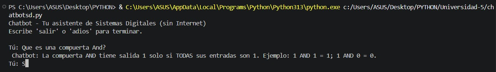

# taller_chatbot_db_tacha
---
Creacion codigo python para chatbot local 
---
Estudiante: Kevin Alejandro Tacha Herrera

Profesor: Diego Alejandro Barragan Vargas

---

Link de este repositorio: https://github.com/KevinTacha/taller_chatbot_db_tacha.git

---

### Chatbot de Sistemas Digitales

**Chatbot educativo** con personalidad de tutor experto en **sistemas digitales**.  
**100% local** – no requiere API Key ni conexión a Internet.  
**Basado en coincidencia de patrones** y palabras clave.  
**Memoria simple** que recuerda el último tema preguntado.  
**Respuestas variadas** gracias a selección aleatoria de frases.

---

### ¿Qué conceptos puede explicar?

- **Compuertas lógicas**: AND, OR, NOT, XOR, NAND, NOR.
- **Flip‑flops y latches**: SR, JK, D, T, latch.
- **Circuitos combinacionales**: sumador (half/full adder), multiplexor, decodificador.
- **Circuitos secuenciales**: contadores, registros de desplazamiento.
- **Arquitectura de computadores**: ALU, CPU, buses, memoria RAM/ROM.
- **Conceptos generales**: sistema digital, sistema binario, tabla de verdad.

---

### Resultado Esperado:

